Ini adalah aplikasi chat yang menggunakan tRPC

# Install Git

Download dan install git untuk yang belum install [Link Git](https://git-scm.com/downloads)

Kemudian configurasi username dan email git anda dengan cara berikut 

```
git config --global user.name = [username github]
git config --global user.email = [email github]     
```


# Cloning Repo

Untuk mengcloning repo ini, anda harus masuk ke command prompt/terminal, lalu ketik 
```
git clone https://github.com/Frasydi/chat-App-With-tRPC
```

Jika sudah selesai, masuk ke foldernya dengan mengetik di terminal 
```
cd chat-App-With-tRPC
```

# Install Module dan konfigurasi database
Untuk menginstall module, kalian cukup mengetik
```
yarn install
```

Dan untuk menginisialisasi database
```
yarn database
```

# Jalankan aplikasi
cukup ketikkan
```
yarn build
yarn start
```

# Menggunakan database lain

Jika ingin menggunakan database yang lain, masuk ke folder backend, lalu ikuti langkah-langkah berikut
>Untuk masuk ke folder backend ketik perintah '`cd packages/backend`'

1. Rubah nilai dari DATABASE_URL di file .env


.env
```env

DATABASE_URL = [url dari database]

```

2. Kemudian masuk ke folder prisma, lalu buka file `schema.prisma`

```prisma

datasource db {
  provider = "tipe dari databasemu(seperti postgre, mariadb, sqlite,atau mysql)"
  url      = env("DATABASE_URL")
}

```

3. setelah itu ketik perintah berikut 
```terminal
npx prisma generate
```

# Menambah Router
untuk menambah router pada backend, cukup masuk ke folder backend, lalu ikuti langkah-langkah berikut

1. buka trRouter.ts

trRouter.ts

```typescript
const tRouter =  t.router({
    //...router
})
```
masukkan router anda ke dalam data json dari t.router()

contoh

trRouter.ts

```typescript
const tRouter = t.router({
    namaRouter : t.procedure.
    input(z.string()).
    query() // atau t.procedure.input().mutation() untuk input data ke database
})
```
>z.string() maksudnya bahwa inputan yang dibolehkan hanyalah string. Anda dapat menggunakan z.object({tes:z.string()}) untuk hanya membolehkan object dengan property tes supaya bisa diinput, baca dokumentasi z.string di [sini](https://zod.dev/?id=introduction)

>query berarti menampilkan data, mutation berarti memasukkan data, 
untuk lebih jelasnya kalian bisa baca dokumentasinya di [sini](https://trpc.io/docs/quickstart)

# Menggunakan backend ini di frontend

Untuk menggunakan backend ini di aplikasi Anda. Pertama-tama buatlah sebuah folder(terserah namanya apa) lalu ikuti langkah-langkah berikut

1. Inisialisasi NPM dengan command
```
npm init -y
```

2. ketik perintah berikut di terminal
```
npm install @trpc/client ts-node
```
3. Buat file index.ts, lalu ketik kode berikut

```typescript
import { createTRPCProxyClient, httpBatchLink } from '@trpc/client';


const trpc = createTRPCProxyClient<any>({
  links: [
    httpBatchLink({
      url: 'http://localhost:8000/trpc',
    }),
  ],
});
```
masuk ke package json lalu rubah isi dari propery script menjadi berikut 

```json
"scripts": {
    "start": "ts-node index",
  },
```

4. setelah itu inisialisasi typescript menggunakan command 
```
tsc init
```

5. Masuk lagi ke index.ts dan masukkan kode berikut

```typescript 
import { createTRPCProxyClient, httpBatchLink } from '@trpc/client';


const trpc = createTRPCProxyClient<any>({
  links: [
    httpBatchLink({
      url: 'http://localhost:8000/trpc',
    }),
  ],
});

trpc.namadarirouterkalian.query()

```

>Router yang saya buat, hampir semuanya memerlukan cookie. Jadi alangkah baiknya jika kalian membuat aplikasi web untuk menggunakan backend ini

# Diagram Router 


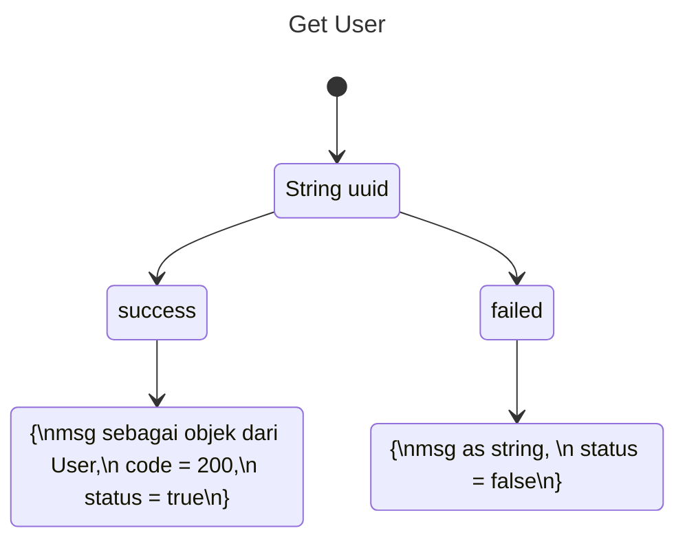

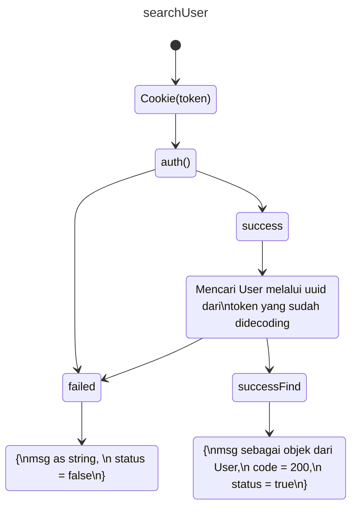

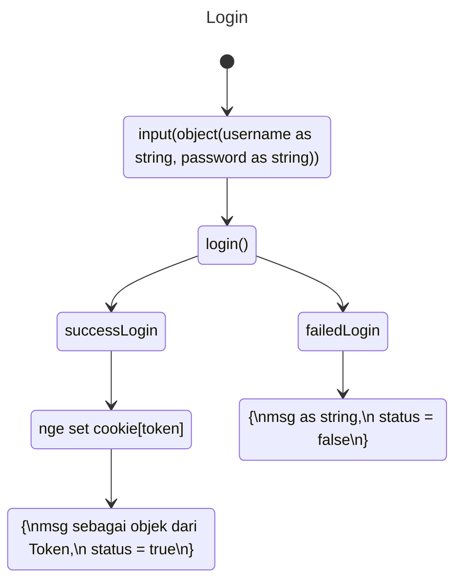
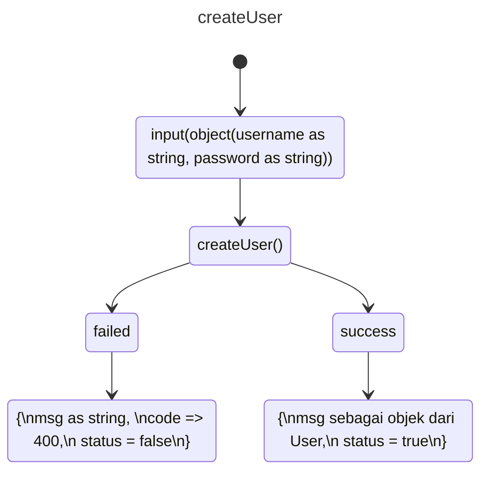
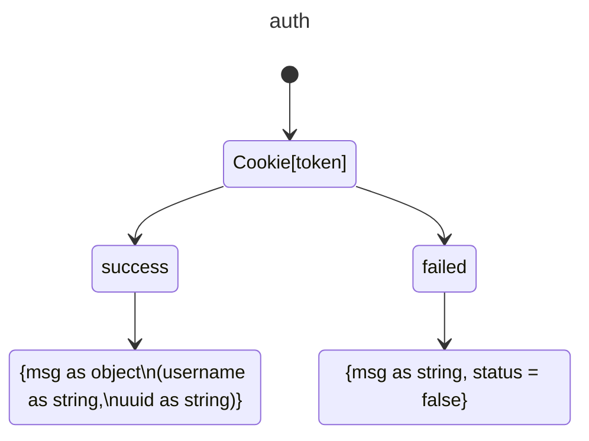

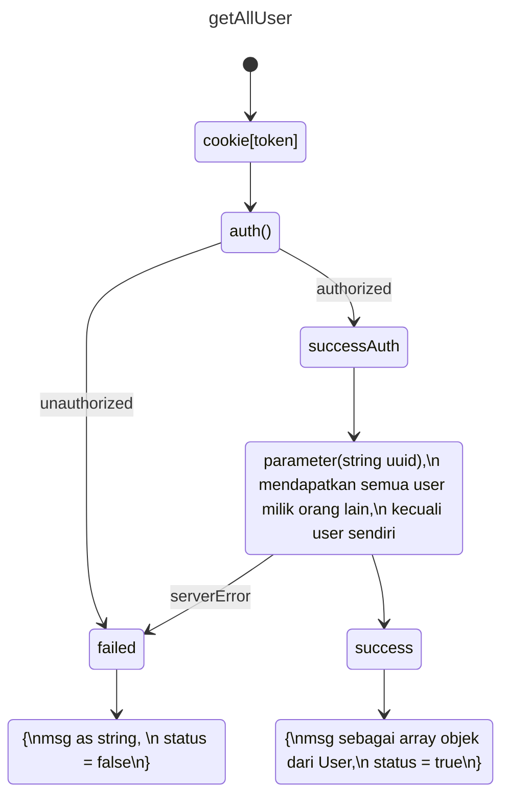

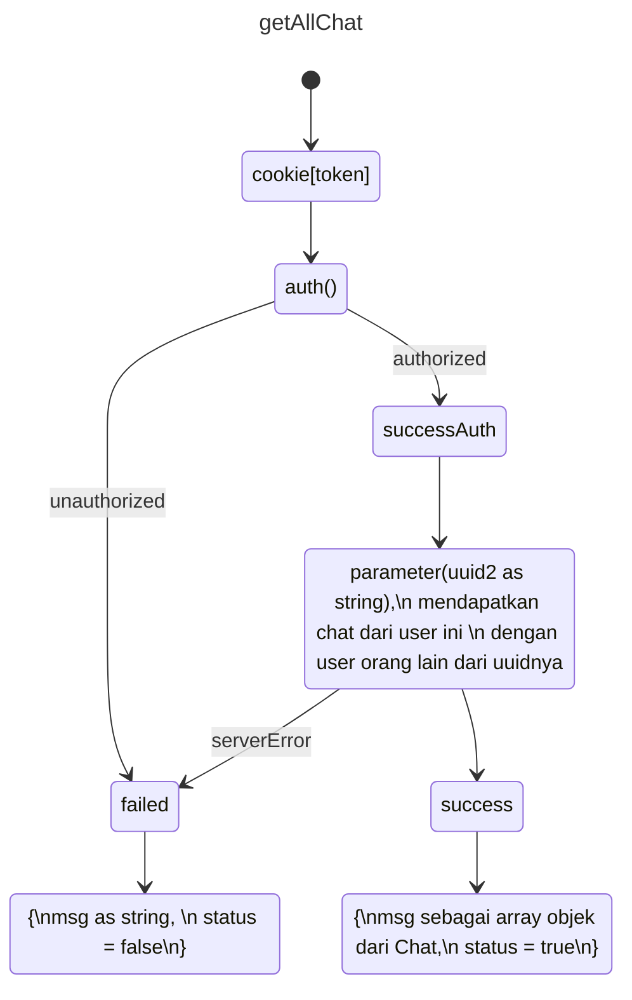


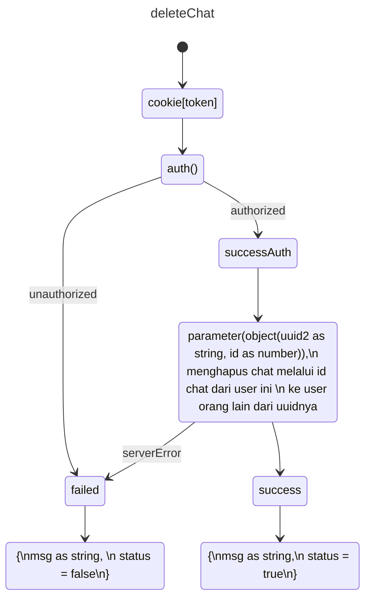


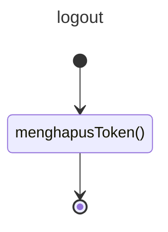

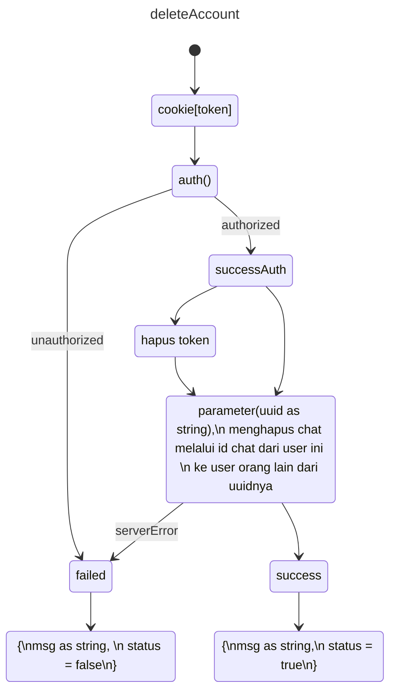

# Diagram Schema

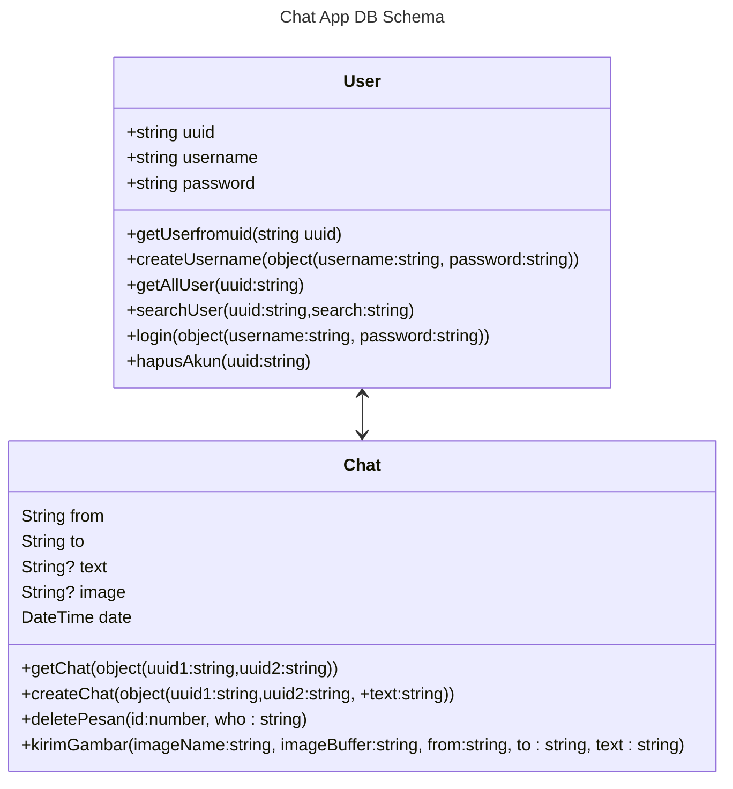